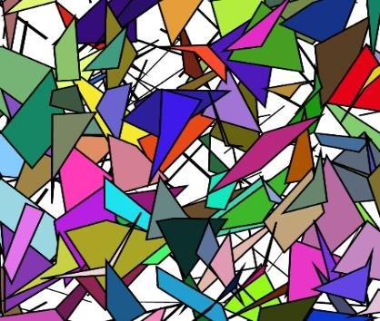
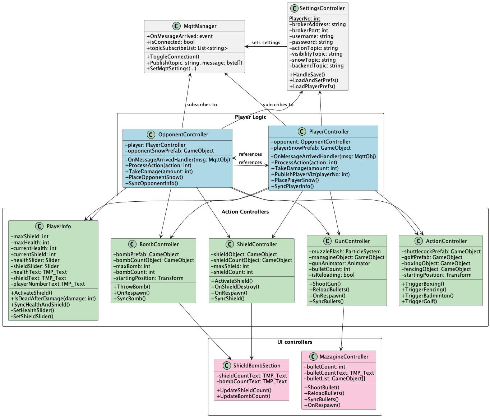
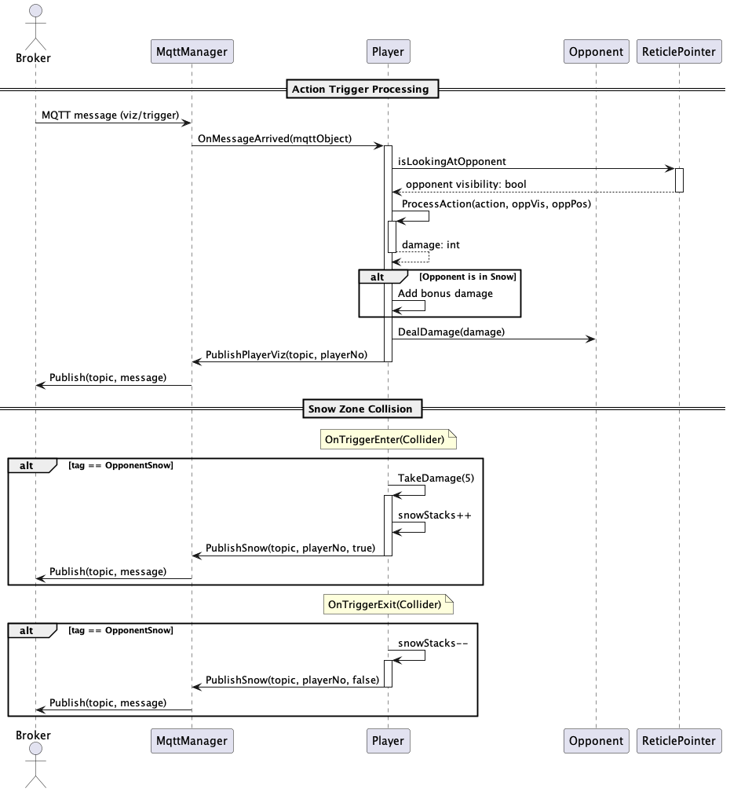
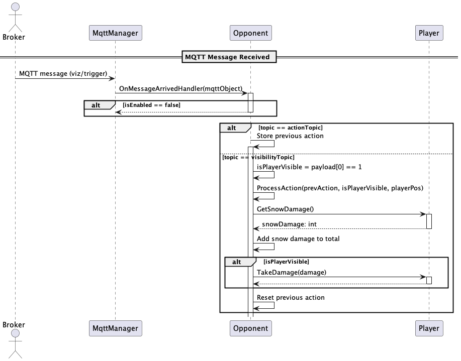

# Developer Guide 👨‍💻

## CG4002 Computer Engineering Capstone Project

This guide outlines the architecture and logic of the AR Laser Tag Visualiser Unity app. The visualiser displays player actions, effects, and status in AR using real-time data from a wearable system via MQTT. It’s designed to help developers understand the system flow and contribute effectively.

## Basic Game Mechanics

### 📸 Image Targets
Each player wears a printed image target on their body, which is tracked by the opponent’s AR device to render virtual effects at the correct physical location. The image was selected for high contrast and distinct edges, improving recognition accuracy and tracking stability under various lighting and distance conditions. Together with the Vuforia engine, we are able to detect the image target from a distance of **2-3 metres**. 

<p align="center">
    
</p>

### 📐 Floor Reference
By default, Vuforia's coordinate system is initialized relative to the phone’s starting camera position. This means if the app is launched while the player is standing, the virtual ground plane appears at eye level. 

To resolve this, we introduced a dedicated floor image target placed in the real world and set **Vuforia’s World Center Mode** to `SPECIFIC_TARGET`. This ensures that Unity’s world origin aligns with the physical floor, allowing for accurate placement of the snow bomb effects. The imaged for floor reference is a QR code which can be found [here](images/floor_qr.jpg).

### 🎯 Reticle Pointer
The reticle pointer was adapted from the Google Cardboard plugin and serves as a visual indicator of **whether the opponent is currently in sight**. 

It is centered in the AR camera view and dynamically adjusts based on visibility: it expands into a donut when the opponent is detected and shrinks to a dot when not. This provides feedback to players and ensures that actions like shooting or launching projectiles are only effective when aimed properly.

Apart from providing a visual feedback, this class also provides a **static boolean** variable called `isLookingAtOpponent` which tells if the opponent is in sight.

## 🧠 Logic Architecture

The logic in the **AR Laser Tag Visualiser** is centered around 2 primary entities: the **Player** and the **Opponent**, both of which interact with each other and respond to incoming MQTT messages.

### 🔁 Entity Setup
<table>
  <tr>
    <th>Player</th>
    <th>Opponent</th>
  </tr>
  <tr>
    <td>Attached to the <b>ARCamera</b> object.</td>
    <td>Instantiated and attached to a <b>Vuforia image target</b>.</td>
  </tr>
  <tr>
    <td>Actions originate from the mobile device and move with the player in space.</td>
    <td>Requires the real opponent to wear the printed image target on their body.
</td>
  </tr>
  <tr>
    <td>Maintains a reference to the Opponent to apply effects or deal damage.</td>
    <td>Maintains a reference to the Player as well.
</td>
  </tr>
</table>

### 📡 MQTT Data Flow
The `MqttManager` class is responsible for:

- Establishing the MQTT connection with the broker (hosted on Ultra96).
- Subscribing to relevant topics.
- Forwarding messages to the correct player class based on the player number.

Each player must tap a `Connect` button in the UI to initiate the MQTT connection.

#### 📨 Subscribed Topics
| Topic	| Purpose | Format (hex) |
| ----- | ------- | ------------ |
| `viz/trigger`	| Triggers an action execution | `<PLAYER_NO><ACTION_NO>` | 
| `viz/visibility`	|  Informs visibility state |  `<PLAYER_NO><OPPONENT_VISIBILITY>` | 
| `backend/state`	| Overall state updates from backend | 
| `backend/ready`	| Signals readiness of backend or players | *empty payload*

#### 🎯 Action Dispatch
When a message is received on the `viz/trigger` topic:

1. `MqttManager` checks the `PLAYER_NO`.
2. Sends the corresponding `ACTION_NO` to the `Player` or `Opponent`.

This ensures each player sees the actions performed by their opponent, in real-time.

### 🧩 Action Controllers
All 9 in-game actions are managed by dedicated controller classes:

| Controller        | Handles | Description |
| ----------------- | ------- | ----------- |
| GunController	    | Shoot, Reload     | Gun-based actions | 
| ShieldController  | Shield Activation | Auxiliary action |
| BombController    | Snow Bomb | Auxiliary action |
| ActionController	| Boxing, Fencing, Badminton, Golf | Sports-based actions |  

> Logout not implemented (Only used by backend)

### 🗂️ Project Hierarchy
Below is the simplified Unity scene hierarchy that outlines how major GameObjects are structured in the project:
```
📌 ARCamera
 └── 🧍‍♂️ Player
      ├── PlayerController (Script)
      ├── GunController (Script)
      ├── ShieldController (Script)
      ├── BombController (Script)
      └── ActionController (Script)

📌 OpponentImageTarget (Vuforia Image Target)
 └── 🧍 Opponent
      ├── OpponentController (Script)
      ├── GunController (Script)
      ├── ShieldController (Script)
      ├── BombController (Script)
      └── ActionController (Script)

📌 MqttManager (Singleton/Scene Object)
 ├── Handles MQTT connection
 └── Routes messages to Player/Opponent
```

Across the different scripts, we have the follow class diagram to show their relationship with one another:



The class diagram reflects the application's **distributed game state** framework, where player-specific stats and logic are encapsulated within their respective controller classes rather than being stored in a centralized global state. Components such as `GunController`, `ShieldController`, `BombController`, and `ActionController` manage their own state (e.g., ammo count, shield availability). 

While this distributed approach introduces some additional overhead, we can easily customize player behaviors, support unique loadouts, and extend the game to more players without tightly coupling all logic to a single class. 


### 🧩 Sequence Diagram Explanation – Player

The sequence diagram illustrates how the Player processes actions in response to MQTT messages. 
1. When an action trigger is received from the broker, the `MqttManager` verifies the topic and player number before forwarding it to the `Player` object. 
2. The `Player` then calls `ProcessAction`, which delegates the request to the appropriate controller (e.g., gun, shield, bomb). 
3. Each controller checks if the action is valid (e.g., enough ammo, shield not active) before executing it.
4. Damage is calculated but only applied if the player has the opponent in sight and this is obtained from the [`ReticlePointer`](#reticle-pointer) class via the static `isLookingAtOpponent` variable.
5. The player publishes their visibility status after an action.

When the player enters a snow zone (OpponentSnow)
1. `OnTriggerEnter` will be called (by Unity collider object)
2. Player take 5 damage and increment their snow stack counter 
3. Publish a message to notify the broker about snow status

Upon exiting the zone, the snow stack is decremented, and another message is sent to update the player's snow status.



### 🧩 Sequence Diagram Explanation – Opponent

Since a player only publishes the visibility status of their opponent after receiving the opponent's action, the opponent must be designed to listen for both the action message from the backend server and the visibility message published by the opposing player.

With this in mind, the opponent processes its action in the following steps:

1. When a `viz/trigger` message is received, the opponent stores the action to be displayed later.
2. Upon receiving a `viz/visibility` message, the opponent checks if the player is visible, 
3. Process and display the previously stored action
4. Calculates any snow damage, and applies the total damage to the player only if visible.
5. After applying the action, the stored action is reset to avoid repeat execution.

> Note: Snow state is only sent via the Player object as each device can determine if the camera has entered the opponent's snow effect.



### ⚙️ `ProcessAction` Function Overview

The `ProcessAction(int action, bool isLookingAtOpponent, Vector3 opponentPos)` function in both PlayerController and OpponentController is responsible for orchestrating the execution of a game action. Here's how it works:

1. Action Routing:

Based on the action number, the request is delegated to the corresponding logic controller:

- `GunController` for shooting or reloading
- `ShieldController` for activating shields
- `BombController` for launching snow bombs
- `ActionController` for sports actions (boxing, fencing, badminton & golf)

2. Validity Checks:

Each controller is responsible for verifying that the action can be performed before executing it. Examples include:

- `GunController` checks if bullets are available before shooting.
- `ShieldController` checks if the player has shield units available and no shield is currently active before allowing shield activation.
- `BombController` checks bomb inventory before launching.
- `ActionController` doesn't check anything 

3. Action Execution & Damage Calculation

If the action is valid and `isLookingAtOpponent` is true, the action is performed with projectiles landing at the opponent's position. For snow bomb action, the snow effect will be instantiated at the opponent's position.

4. Return Value:

The function returns the amount of damage dealt to the opponent. 

### 🔄 Backend State Synchronization

While each player currently maintains their own local copy of the game state through various controller classes, discrepancies may arise due to misclassified actions or network issues. To address this, a periodic state packet is sent from the backend, serving as the source of truth for the visualizer. Upon receiving this packet, the application refreshes its local state across all relevant controllers (e.g., health, bullets, shields, bomb count, death count), ensuring that any inconsistencies are corrected and the gameplay experience remains synchronized and accurate.

The state synchronization logic is triggered when the player receives an MQTT message on the `backend/state` topic. The message contains the latest values for the player's and opponent's state, and the `SyncPlayerInfo()` and `SyncOpponentInfo()` functions  are responsible for updating the in-game UI and logic accordingly.

```csharp
public void SyncPlayerInfo(int health, int bullets, int bomb, int shieldHealth, int deaths, int shieldCount)
```

#### Function Call Breakdown:

| Information | Function |
| ----------- | -------- |
|Health and Shield health |`PlayerInfo.SyncHealthAndShield(health, shieldHealth)`|
| Shield Inventory |  `ShieldController.SyncShield(shieldCount, shieldHealth)` |
| Bullets | `GunController.SyncBullets(bullets)` |
| Bomb Count | `BombController.SyncBomb(bomb)` |
| Death Counter | `KillDeathSection.UpdateDeathCount(deaths)` |

